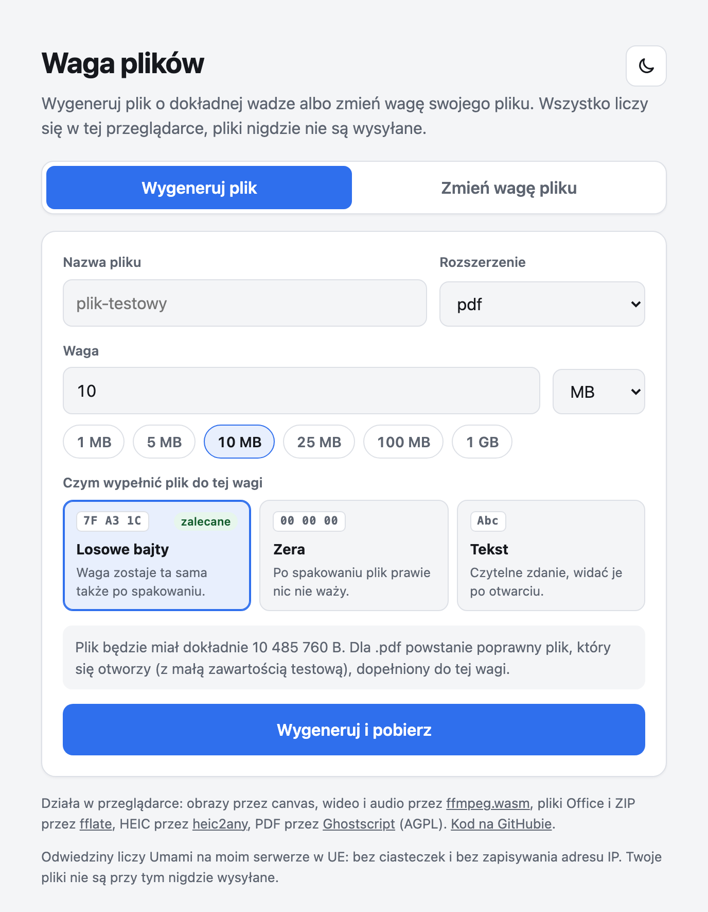

<h1 align="center">Waga plików</h1>

<p align="center">
  Plik o dokładnie takiej wadze, jakiej potrzebujesz. Albo Twój plik, tylko lżejszy lub cięższy.<br>
  Wszystko dzieje się w przeglądarce, pliki nigdzie nie wychodzą.
</p>

<p align="center">
  <a href="https://waga.michalmarini.pl/"><b>➜ waga.michalmarini.pl</b></a>
</p>

<p align="center">
  <picture>
    <source media="(prefers-color-scheme: dark)" srcset="docs/screen-ciemny.png">
    
  </picture>
</p>

## Skąd ten pomysł

Testuję aplikacje i musiałem sprawdzać, jak radzą sobie z wgrywaniem plików o różnej wadze. Nie chciałem robić wszystkiego w terminalu, a w sieci nie znalazłem narzędzia, które by to załatwiło. Zrobiłem więc własne.

## Co potrafi

**Wygenerować plik o zadanej wadze, co do bajta.** Wybierasz rozszerzenie, wpisujesz wagę (z przecinkiem albo kropką, np. `95,5`) i pobierasz. Dla popularnych formatów powstaje prawdziwy plik, który się otwiera:

`pdf` `docx` `odt` `rtf` `txt` `xlsx` `csv` `ods` `pptx` `heic` `jpg` `png` `webp` `gif` `bmp` `svg` `zip`

a przez opcję „Inne” także `mp4`, `mov`, `mp3`, `wav` i pliki tekstowe. Każde inne rozszerzenie (`doc`, `xls`, `rar`, `7z`…) dostaje właściwą nazwę i wagę, w środku jest samo wypełnienie. Do testowania limitów uploadu to zwykle wystarcza.

**Zmienić wagę Twojego pliku.** Przeciągasz plik na stronę i mówisz, ile ma ważyć: 95 MB → 90 MB albo 2 MB → 5 MB. Przy zmniejszaniu plik jest kompresowany, a nie obcinany, więc dalej się otwiera. Nazwa pliku zostaje taka sama, a zdjęcie JPG zachowuje dane z aparatu (model, data, lokalizacja).

**Liczyć tak jak Twój program.** Przełącznik `1 MB = 1024 KB` (Windows, Chrome, domyślnie) albo `1 MB = 1000 KB` (Finder), bo „10 MB” w Finderze i w Eksploratorze to nie to samo. Strona pamięta ostatni wybór, a przy wyniku pokazuje wagę w obu systemach.

Do tego tryb jasny i ciemny, szybkie wagi jednym kliknięciem i porównanie przed/po.

## Prywatność

Pliki nie są nigdzie wysyłane. Generowanie, kompresja i przekodowanie wideo dzieją się na Twoim komputerze lub telefonie. Odwiedziny strony liczy [Umami](https://umami.is/) na moim serwerze w UE, bez ciasteczek i bez zapisywania adresu IP.

## Jak to działa

<details>
<summary><b>Powiększanie:</b> gdzie trafia wypełnienie</summary>

<br>

| Format | Gdzie trafia wypełnienie |
|---|---|
| xlsx, docx, pptx, odt, ods, epub | białe znaki po głównym elemencie XML wewnątrz archiwum (np. `docProps/app.xml`) |
| zip, jar | dodatkowy plik `padding.bin` w archiwum |
| mp4, mov, m4a, heic, heif, avif | blok `free` na końcu (odtwarzacze go pomijają) |
| mp3 | znacznik ID3v2 na początku (czas trwania się nie zmienia) |
| pdf | komentarz PDF i powtórzony `startxref` |
| pozostałe | bajty dopisane na końcu |

</details>

<details>
<summary><b>Zmniejszanie:</b> jak plik chudnie</summary>

<br>

| Format | Jak |
|---|---|
| jpg, webp | niższa jakość, a gdy to za mało, niższa rozdzielczość |
| png | niższa rozdzielczość |
| heic | dekodowanie przez heic2any, wynik w **JPG** (przeglądarki nie zapisują HEIC) |
| pdf | Ghostscript w przeglądarce: najpierw samo uporządkowanie struktury, potem coraz mocniejsza kompresja zdjęć (300 → 50 dpi). Wybierany jest najłagodniejszy poziom, który się mieści. Tekst i wektory zostają |
| xlsx, docx, pptx, odt, ods, epub | mocniejsza kompresja ZIP, potem mniejsze zdjęcia w środku. Dane i tekst bez zmian |
| zip | mocniejsza kompresja, zawartość bez zmian |
| wideo | przekodowanie do MP4 (H.264 + AAC) z bitrate dobranym do wagi |
| audio | przekodowanie do MP3 (m4a i aac zostają w M4A) |

Domyślnie wynik jest dopełniany do dokładnej wagi docelowej. Można to wyłączyć.

</details>

## Ograniczenia

- **Wideo liczy się wolniej niż w programie na komputerze**, bo koduje je przeglądarka. Przykład: 20 s nagrania 720p z 22,7 MB do 10 MB trwa ok. 100 s na MacBooku. Plik rzędu 100 MB to kilkanaście minut lub więcej. Limit to ok. 1,5 GB.
- **PDF:** pierwsze zmniejszenie pobiera Ghostscript (ok. 15 MB). Przykład: 8 stron ze zdjęciami z 15,7 MB do 3 MB w ok. 30 s.
- **HEIC po zmniejszeniu staje się JPG.** Przeglądarki nie potrafią zapisać HEIC.
- Pliki ZIP i Office powyżej 4 GB nie są obsługiwane (brak ZIP64).
- Plików zabezpieczonych hasłem ani nieznanych formatów nie da się zmniejszyć bez uszkodzenia.
- Stare formaty Office (`xls`, `doc`, `ppt`) po powiększeniu mogą zgłosić błąd.

## Dla programistów

Statyczna strona: HTML, CSS i JavaScript, bez budowania i bez zależności do instalowania.

```bash
python3 -m http.server 8765
# http://127.0.0.1:8765/
```

Lokalny serwer nie wysyła nagłówków COOP/COEP, więc wideo liczy się tam na jednym wątku. Na produkcji nagłówki ustawia Netlify z pliku `_headers` i działa wielowątkowy `@ffmpeg/core-mt`.

Biblioteki, ładowane dopiero wtedy, gdy są potrzebne:

- [ffmpeg.wasm](https://github.com/ffmpegwasm/ffmpeg.wasm): `@ffmpeg/ffmpeg` 0.12.15 i `@ffmpeg/util` 0.12.2 w `vendor/` (worker musi być z tej samej domeny), rdzeń `@ffmpeg/core` 0.12.10 z jsDelivr. MIT
- [fflate](https://github.com/101arrowz/fflate) 0.8.3 do ZIP i plików Office. MIT
- [heic2any](https://github.com/alexcorvi/heic2any) 0.0.4 do zdjęć z iPhone'a. MIT
- [ghostpdl-wasm](https://github.com/okathira/ghostpdl-wasm) 1.1.0, czyli Ghostscript w WebAssembly, do PDF. **AGPL-3.0**: dlatego kod tej strony jest publiczny, a źródła Ghostscript są w repo okathira/ghostpdl-wasm

`templates.js` zawiera małe poprawne pliki (heic, mp4, mov, mp3, gif) wygenerowane przez ffmpeg i `sips`.

Strona stoi na Netlify i jest wdrażana ręcznie (`netlify deploy --prod --dir=.`), bez łączenia repo z Netlify. Stary adres na GitHub Pages przekierowuje na nowy.

## Licencja

[MIT](LICENSE) © Michał Marini. Uwaga na Ghostscript (AGPL-3.0), opis wyżej.
